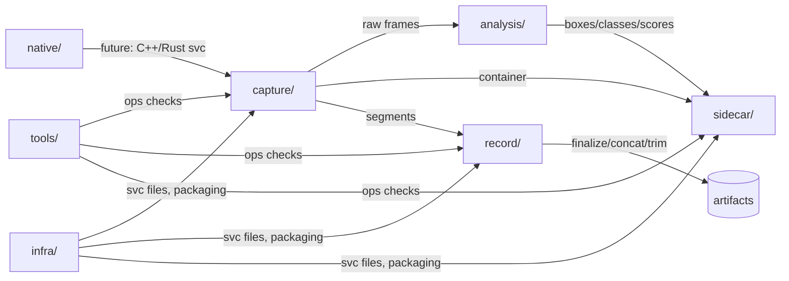

[](https://github.com/raedalhaddad/prod-video-stack/actions/workflows/ci.yml?query=branch%3Amain)

# prod-video-stack

Production-grade video analysis stack **skeleton**. This greenfield repo hosts the modernized capture/record/sidecar toolchain while the legacy app continues to run for stability.

## Architecture (high-level)



## Getting started (Windows PowerShell)

```powershell
python -m venv .venv
. .\.venv\Scripts\Activate.ps1
pip install -U pip
pip install -e .[dev]

pre-commit install
pre-commit run --all-files
pre-commit run --all-files

pytest

python -m tools.check_sync --help
python -m tools.check_sync sample -o tools\samples\sync_report.md
```

> **Note:** Do **not** run `pre-commit autoupdate` while on Python 3.9 for the isort repo. Hooks are pinned to Py3.9-safe versions.
